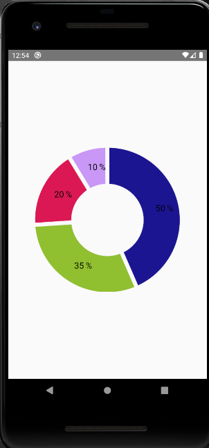
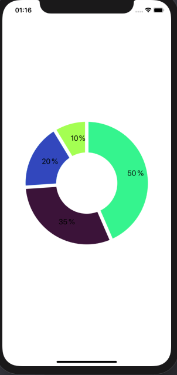

<div align="center">
  
  
</div>  

## :computer: Projeto

Aplicação para prova de conceito utilizando gráficos.

## :pushpin: Tecnologias

Esse projeto foi desenvolvido com as seguintes tecnologias:

- [React Native](https://reactnative.dev/)
- [react-native-svg-charts](https://github.com/JesperLekland/react-native-svg-charts)


## :point_down: Executando o projeto

No seu terminal copie e cole ou digite o comando abaixo:

```git
git clone https://github.com/jhowsantos/poc-svg-chart.git
````

Após realizar o clone acesse a pasta do projeto:

```git
cd poc-svg-chart
````

Logo em seguida digite o comando __*yarn*__ para baixar e atualizar as dependências do projeto

Para executar o projeto digite em seu terminal o comando:

_**Para Android**_
```terminal
yarn android
````
_**Para IOS**_
```terminal
yarn ios
````

---
Feito com coração, café e muito esforço :heart: :rocket: